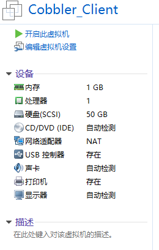
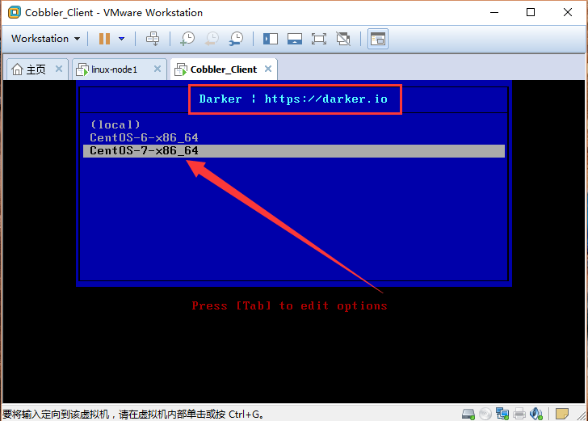
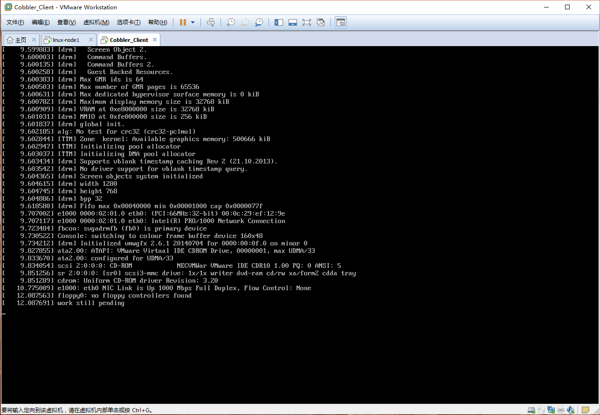
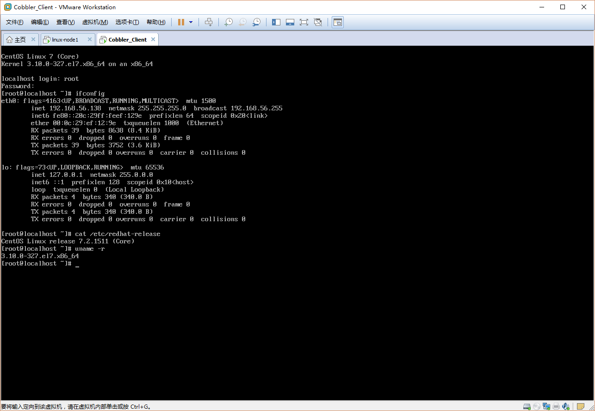

# 初识Cobbler自动安装Linux

Cobbler is a Linux installation server that allows for rapid setup of network installation environments. It glues together and automates many associated Linux tasks so you do not have to hop between many various commands and applications when deploying new systems, and, in some cases, changing existing ones. Cobbler can help with provisioning, managing DNS and DHCP, package updates, power management, configuration management orchestration, and much more.

cobbler官网：http://cobbler.github.io/

以上是官网给的介绍，用个人的话来说就是`cobbler`就是一款通过网络快速安装Linux操作系统的产品，cobbler可以配置，管理DNS和DHCP，包括软件包的更新，电源管理，配置管理流程等，类似于`PXE`+`Kickstart`。

---

## 环境介绍

|HostName|IP|OS|Character|
|:--|:--|:--|:--|
|linux-node1.example.com|192.168.56.11|CentOS-7-x86_64|Cobbler服务端|
|linux-node2.example.com|192.168.56.12|CentOS-7 or CentOS-6.7|Cobbler客户端，一台创建好的空虚拟机，操作系统也没有安装|

## 基础环境查看及初始化

基础环境查看

查看主机名

```bash
[root@linux-node1 ~]# hostname
linux-node1.example.com
```

OS使用`CentOS 7.2`

```bash
[root@linux-node1 ~]# cat /etc/redhat-release 
CentOS Linux release 7.2.1511 (Core) 
```

内核版本

```bash
[root@linux-node1 ~]# uname -r
3.10.0-327.18.2.el7.x86_64
```

使用的用户

```
[root@linux-node1 ~]# whoami 
root
```

网卡信息

```bash
[root@linux-node1 ~]# ifconfig 
eth0: flags=4163<UP,BROADCAST,RUNNING,MULTICAST>  mtu 1500
        inet 192.168.56.11  netmask 255.255.255.0  broadcast 192.168.56.255
        inet6 fe80::20c:29ff:fec3:95b1  prefixlen 64  scopeid 0x20<link>
        ether 00:0c:29:c3:95:b1  txqueuelen 1000  (Ethernet)
        RX packets 150  bytes 48200 (47.0 KiB)
        RX errors 0  dropped 0  overruns 0  frame 0
        TX packets 88  bytes 15057 (14.7 KiB)
        TX errors 0  dropped 0 overruns 0  carrier 0  collisions 0

lo: flags=73<UP,LOOPBACK,RUNNING>  mtu 65536
        inet 127.0.0.1  netmask 255.0.0.0
        inet6 ::1  prefixlen 128  scopeid 0x10<host>
        loop  txqueuelen 0  (Local Loopback)
        RX packets 0  bytes 0 (0.0 B)
        RX errors 0  dropped 0  overruns 0  frame 0
        TX packets 0  bytes 0 (0.0 B)
        TX errors 0  dropped 0 overruns 0  carrier 0  collisions 0
```

网卡配置文件

```bash
[root@linux-node1 ~]# cat /etc/sysconfig/network-scripts/ifcfg-eth0 
TYPE="Ethernet"
BOOTPROTO="static"
IPADDR=192.168.56.11
NETMASK=255.255.255.0
GATEWAY=192.168.56.2
DNS1=192.168.56.2
DEFROUTE="yes"
IPV4_FAILURE_FATAL="no"
IPV6INIT="yes"
IPV6_AUTOCONF="yes"
IPV6_DEFROUTE="yes"
IPV6_FAILURE_FATAL="no"
NAME="eth0"
UUID="e7355cf7-73c2-48bb-a2be-635040e76a52"
DEVICE="eth0"
ONBOOT="yes"
PEERDNS="yes"
PEERROUTES="yes"
IPV6_PEERDNS="yes"
IPV6_PEERROUTES="yes"
IPV6_PRIVACY="no"
```

初始化配置

关闭`SElinux`

```bash
[root@linux-node1 ~]# vim /etc/selinux/config 
# This file controls the state of SELinux on the system.
# SELINUX= can take one of these three values:
#     enforcing - SELinux security policy is enforced.
#     permissive - SELinux prints warnings instead of enforcing.
#     disabled - No SELinux policy is loaded.
SELINUX=disabled
# SELINUXTYPE= can take one of three two values:
#     targeted - Targeted processes are protected,
#     minimum - Modification of targeted policy. Only selected processes are protected. 
#     mls - Multi Level Security protection.
SELINUXTYPE=targeted
```

关闭防火墙

```bash
[root@linux-node1 ~]# systemctl stop firewalld
[root@linux-node1 ~]# systemctl disable firewalld
```

关闭`postfix`

```
[root@linux-node1 ~]# systemctl stop postfix
[root@linux-node1 ~]# systemctl enable postfix
```

配置YUM源

```bash
[root@linux-node1 ~]# cd /etc/yum.repos.d/
[root@linux-node1 yum.repos.d]# mkdir repo
[root@linux-node1 yum.repos.d]# mv * repo
mv: cannot move ‘repo’ to a subdirectory of itself, ‘repo/repo’
[root@linux-node1 yum.repos.d]# rpm -ivh http://mirrors.aliyun.com/centos/7.2.1511/os/x86_64/Packages/wget-1.14-10.el7_0.1.x86_64.rpm
[root@linux-node1 yum.repos.d]# wget -O /etc/yum.repos.d/CentOS-Base.repo http://mirrors.aliyun.com/repo/Centos-7.repo
[root@linux-node1 yum.repos.d]# wget -O /etc/yum.repos.d/epel.repo http://mirrors.aliyun.com/repo/epel-7.repo
```

重启系统

```bash
[root@linux-node1 yum.repos.d]# reboot 
```

检查`SElinux`和`防火墙`是否已经关闭

```bash
[root@linux-node1 ~]# getenforce 
Disabled
[root@linux-node1 ~]# systemctl status firewalld 
● firewalld.service - firewalld - dynamic firewall daemon
   Loaded: loaded (/usr/lib/systemd/system/firewalld.service; disabled; vendor preset: enabled)
   Active: inactive (dead)
```

## 安装`Cobbler`

`yum`安装`Cobbler`所需要的软件包

```bash
[root@linux-node1 ~]# yum install -y httpd dhcp tftp cobbler cobbler-web pykickstart
```

启动`httpd`和`cobblerd`

```bash
[root@linux-node1 ~]# systemctl start httpd.service
[root@linux-node1 ~]# systemctl start cobblerd.service
```

验证服务是否启动

```bash
[root@linux-node1 ~]# netstat -tlnp
Active Internet connections (only servers)
Proto Recv-Q Send-Q Local Address           Foreign Address         State       PID/Program name    
tcp        0      0 0.0.0.0:22              0.0.0.0:*               LISTEN      1462/sshd           
tcp        0      0 127.0.0.1:25151         0.0.0.0:*               LISTEN      1778/python2        
tcp6       0      0 :::80                   :::*                    LISTEN      1749/httpd          
tcp6       0      0 :::22                   :::*                    LISTEN      1462/sshd           
tcp6       0      0 :::443                  :::*                    LISTEN      1749/httpd    
```

设置开机自启动

```bash
[root@linux-node1 ~]# systemctl enable httpd.service  
Created symlink from /etc/systemd/system/multi-user.target.wants/httpd.service to /usr/lib/systemd/system/httpd.service.
[root@linux-node1 ~]# systemctl enable cobblerd.service
Created symlink from /etc/systemd/system/multi-user.target.wants/cobblerd.service to /usr/lib/systemd/system/cobblerd.service.
```

## 配置`Cobbler`

获取cobbler的命令

```bash
[root@linux-node1 ~]# cobbler profile
usage
=====
cobbler profile add
cobbler profile copy
cobbler profile dumpvars
cobbler profile edit
cobbler profile find
cobbler profile getks
cobbler profile list
cobbler profile remove
cobbler profile rename
cobbler profile report
```

执行`cobbler check`查看`cobbler`所需要的配置

```bash
[root@linux-node1 ~]# cobbler check
The following are potential configuration items that you may want to fix:

1 : The 'server' field in /etc/cobbler/settings must be set to something other than localhost, or kickstarting features will not work.  This should be a resolvable hostname or IP for the boot server as reachable by all machines that will use it.
2 : For PXE to be functional, the 'next_server' field in /etc/cobbler/settings must be set to something other than 127.0.0.1, and should match the IP of the boot server on the PXE network.
3 : change 'disable' to 'no' in /etc/xinetd.d/tftp
4 : some network boot-loaders are missing from /var/lib/cobbler/loaders, you may run 'cobbler get-loaders' to download them, or, if you only want to handle x86/x86_64 netbooting, you may ensure that you have installed a *recent* version of the syslinux package installed and can ignore this message entirely.  Files in this directory, should you want to support all architectures, should include pxelinux.0, menu.c32, elilo.efi, and yaboot. The 'cobbler get-loaders' command is the easiest way to resolve these requirements.
5 : enable and start rsyncd.service with systemctl
6 : debmirror package is not installed, it will be required to manage debian deployments and repositories
7 : The default password used by the sample templates for newly installed machines (default_password_crypted in /etc/cobbler/settings) is still set to 'cobbler' and should be changed, try: "openssl passwd -1 -salt 'random-phrase-here' 'your-password-here'" to generate new one
8 : fencing tools were not found, and are required to use the (optional) power management features. install cman or fence-agents to use them

Restart cobblerd and then run 'cobbler sync' to apply changes.
```

上面提示说我们需要解决以上的问题才可以继续使用`cobbler`，解决完以上问题之后使用`'cobbler sync'`应用更改，上面的问题分别是：

1. 编辑/etc/cobbler/settings文件，找到server选项，修改为Cobbler服务器ip地址
2. 编辑/etc/cobbler/settings文件，找到next_server选项，修改为PXE服务器的IP地址
3. 编辑/etc/xinetd.d/tftp文件，将文件中的disable字段的配置由yes改为no
4. 执行cobbler get-loaders，系统将自动下载loader程序
5. 通过systemctl启动rsyncd.service服务
6. 提示说debian的镜像包没有安装，如果你需要安装ubuntu的系统安装，否则就忽略
7. 修改cobbler用户的默认密码，可以使用如下命令生成密码，并使用生成后的密码替换/etc/cobbler/settings中的密码。生成密码命令：`openssl passwd -1 -salt 'random-phrase-here' 'your-password-here'`
8. 没有找到电源管理工具，你可以安装cman or fence-agents to use them

修改`next_server`与`server`的地址

```bash
[root@linux-node1 ~]# vim /etc/cobbler/settings 
272 next_server: 192.168.56.11
384 server: 192.168.56.11
# 让cobbler管理DHCP服务
242 manage_dhcp: 1
```

启动tftp服务

```bash
[root@linux-node1 ~]# vim /etc/xinetd.d/tftp
        disable                 = no
# xinetd为管理tftp的服务
[root@linux-node1 ~]# systemctl restart xinetd
[root@linux-node1 ~]# systemctl enable xinetd 
```

下载loader程序

```bash
[root@linux-node1 ~]# cobbler get-loaders
task started: 2016-05-29_091733_get_loaders
task started (id=Download Bootloader Content, time=Sun May 29 09:17:33 2016)
downloading http://cobbler.github.io/loaders/README to /var/lib/cobbler/loaders/README
downloading http://cobbler.github.io/loaders/COPYING.elilo to /var/lib/cobbler/loaders/COPYING.elilo
downloading http://cobbler.github.io/loaders/COPYING.yaboot to /var/lib/cobbler/loaders/COPYING.yaboot
downloading http://cobbler.github.io/loaders/COPYING.syslinux to /var/lib/cobbler/loaders/COPYING.syslinux
downloading http://cobbler.github.io/loaders/elilo-3.8-ia64.efi to /var/lib/cobbler/loaders/elilo-ia64.efi
downloading http://cobbler.github.io/loaders/yaboot-1.3.17 to /var/lib/cobbler/loaders/yaboot
downloading http://cobbler.github.io/loaders/pxelinux.0-3.86 to /var/lib/cobbler/loaders/pxelinux.0
downloading http://cobbler.github.io/loaders/menu.c32-3.86 to /var/lib/cobbler/loaders/menu.c32
downloading http://cobbler.github.io/loaders/grub-0.97-x86.efi to /var/lib/cobbler/loaders/grub-x86.efi
downloading http://cobbler.github.io/loaders/grub-0.97-x86_64.efi to /var/lib/cobbler/loaders/grub-x86_64.efi
*** TASK COMPLETE ***
```

修改默认的`root`密码

```bash
# darker是密码的盐 ansheng.me是root的密码
[root@linux-node1 ~]# openssl passwd -1 -salt 'darker' 'ansheng.me'  
$1$darker$.iq3o/C3..6QV.LPXqrE5.
[root@linux-node1 ~]# vim /etc/cobbler/settings 
# 复制上面生成的密码把之前的替换掉
101 default_password_crypted: "$1$darker$.iq3o/C3..6QV.LPXqrE5."
```

重启`cobbler`

```bash
[root@linux-node1 ~]# systemctl restart cobblerd
```

重新检查

```bash
[root@linux-node1 ~]# cobbler check
The following are potential configuration items that you may want to fix:

1 : enable and start rsyncd.service with systemctl
2 : debmirror package is not installed, it will be required to manage debian deployments and repositories
3 : fencing tools were not found, and are required to use the (optional) power management features. install cman or fence-agents to use them

Restart cobblerd and then run 'cobbler sync' to apply changes.
```

上面的错误可以忽略

配置dhcp服务

```bash
# 子网
subnet 192.168.56.0 netmask 255.255.255.0 {
     option routers             192.168.56.2;  # 网关
     option domain-name-servers 192.168.56.2;  # DNS
     option subnet-mask         255.255.255.0; # 子网掩码
     range dynamic-bootp        192.168.56.100 192.168.56.254; # 分配的IP地址池
     default-lease-time         21600;
     max-lease-time             43200;
     next-server                $next_server;
     class "pxeclients" {
          match if substring (option vendor-class-identifier, 0, 9) = "PXEClient";
          if option pxe-system-type = 00:02 {
                  filename "ia64/elilo.efi";
          } else if option pxe-system-type = 00:06 {
                  filename "grub/grub-x86.efi";
          } else if option pxe-system-type = 00:07 {
                  filename "grub/grub-x86_64.efi";
          } else {
                  filename "pxelinux.0";
          }
     }

}
```

同步cobbler配置文件

```bash
[root@linux-node1 ~]# cobbler sync
```

创建镜像挂载点

```bash
[root@linux-node1 ~]# mkdir /mnt/CentOS-6
[root@linux-node1 ~]# mkdir /mnt/CentOS-7
[root@linux-node1 ~]# mount /dev/sr0 /mnt/CentOS-7
mount: /dev/sr0 is write-protected, mounting read-only
[root@linux-node1 ~]# mount /dev/sr1 /mnt/CentOS-6
mount: /dev/sr1 is write-protected, mounting read-only
```

导入镜像，就是把挂在的镜像复制一份到本地硬盘

```bash
[root@linux-node1 ~]# cobbler import --path=/mnt/CentOS-7 --name=CentOS-7-x86_64 --arch=x86_64
[root@linux-node1 ~]# cobbler import --path=/mnt/CentOS-6 --name=CentOS-6-x86_64 --arch=x86_64
```
1. ---path= 镜像路径
2. ---name= 安装操作系统时出现的名称 
3. ---arch= 系统架构

导入镜像文件存放的目录

```bash
[root@linux-node1 ~]# cd /var/www/cobbler/ks_mirror/
[root@linux-node1 ks_mirror]# pwd
/var/www/cobbler/ks_mirror
[root@linux-node1 ks_mirror]# ls
# CentOS-6-x86_64  CentOS-7-x86_64就是我们导入的镜像
CentOS-6-x86_64  CentOS-7-x86_64  config
```
查看已经导入的镜像

```bash
[root@linux-node1 kickstarts]# cobbler list
distros:
   CentOS-6-x86_64
   CentOS-7-x86_64

profiles:
   CentOS-6-x86_64
   CentOS-7-x86_64

systems:

repos:

images:

mgmtclasses:

packages:

files:
```

查看更详细的配置信息

```bash
[root@linux-node1 kickstarts]# cobbler profile report
```

查看某一个镜像的详细信息

```bash
[root@linux-node1 kickstarts]# cobbler profile report --name=CentOS-7-x86_64
```

附上生产环境使用的`CentOS-6-x86_64`和`CentOS-7-x86_64`的ks文件：

[CentOS-7-x86_64.cfg](../images/2016/12/CentOS-7-x86_64.cfg)
[CentOS-6-x86_64.cfg](../images/2016/12/CentOS-6-x86_64.cfg)

默认的`ks`文件存放目录

```bash
[root@linux-node1 ks_mirror]# cd /var/lib/cobbler/kickstarts/
[root@linux-node1 kickstarts]# ls
default.ks    install_profiles  sample_autoyast.xml  sample_esxi4.ks  sample_old.seed
esxi4-ks.cfg  legacy.ks         sample_end.ks        sample_esxi5.ks  sample.seed
esxi5-ks.cfg  pxerescue.ks      sample_esx4.ks       sample.ks
```

如果没有指定`ks`文件，那么默认使用`sample_end.ks`这个文件

上传上面的两个`ks`文件：

```bash
[root@linux-node1 kickstarts]# rz -y
rz waiting to receive.
Starting zmodem transfer.  Press Ctrl+C to cancel.
Transferring CentOS-6-x86_64.cfg...
  100%       3 KB       3 KB/sec    00:00:01       0 Errors  
Transferring CentOS-7-x86_64.cfg...
  100%       1 KB       1 KB/sec    00:00:01       0 Errors  
```

修改镜像默认的`ks`文件

```bash
[root@linux-node1 kickstarts]# cobbler profile edit --name=CentOS-7-x86_64 --kickstart=/var/lib/cobbler/kickstarts/CentOS-7-x86_64.cfg
[root@linux-node1 kickstarts]# cobbler profile edit --name=CentOS-6-x86_64 --kickstart=/var/lib/cobbler/kickstarts/CentOS-6-x86_64.cfg
```

查看修改之后的`ks`文件路径

```bash
[root@linux-node1 kickstarts]# cobbler profile report | grep "Kickstart" 
Kickstart                      : /var/lib/cobbler/kickstarts/CentOS-7-x86_64.cfg
Kickstart Metadata             : {}
Kickstart                      : /var/lib/cobbler/kickstarts/CentOS-6-x86_64.cfg
Kickstart Metadata             : {}
```

修改CentOS7镜像内核参数，让装完系统之后默认的网卡名称以`eth0`开始

```bash
[root@linux-node1 kickstarts]# cobbler profile edit --name=CentOS-7-x86_64 --kopts='net.ifnames=0 biosdevname=0'
```

查看添加的内核参数

```bash
[root@linux-node1 kickstarts]# cobbler profile report --name=CentOS-7-x86_64 | grep "Kernel Options"
Kernel Options                 : {'biosdevname': '0', 'net.ifnames': '0'}
Kernel Options (Post Install)  : {}
```

定制`Cobbler`系统安装界面

```bash
[root@linux-node1 kickstarts]# cd /etc/cobbler/pxe/
[root@linux-node1 pxe]# vim pxedefault.template
DEFAULT menu
PROMPT 0
# 提示的TITLE
MENU TITLE Darker | https://darker.io
TIMEOUT 200
TOTALTIMEOUT 6000
ONTIMEOUT $pxe_timeout_profile

LABEL local
        MENU LABEL (local)
        MENU DEFAULT
        LOCALBOOT -1

$pxe_menu_items

MENU end
```

执行`cobbler sync`应用配置

```bash
[root@linux-node1 kickstarts]# cobbler sync
```

## 新建虚拟机并安装

用`VMware Workstation`新建一个虚拟机，然后启动，创建的虚拟机如下图：



启动系统进入安装界面，选择安装的操作系统，这里我们选择`CentOS-7`，然后回车



正在安装，安装完成后会自动重启



安装完成之后输入我们设置的`root`密码，然后进入系统查看IP地址



到此，一个简单的`cobbler`算是初步部署完成了，更强大的功能会在后几篇问战中介绍。