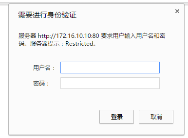

# Nginx实现浏览器实时查看访问日志

在很多时候我们都需要在页面上实时查看nginx的日志输出，并且能在页面上显示，下面小编就给大家说下怎么在浏览器上实时动态的查看nginx的访问日志。

查看nginx版本，我使用的是1.9.7的版本，目前最新的，安装目录在/application/nginx-1.9.7

```bash
[root@AnSheng ~]# /application/nginx-1.9.7/sbin/nginx -V
nginx version: nginx/1.9.7
built by gcc 4.4.7 20120313 (Red Hat 4.4.7-16) (GCC)
configure arguments: --prefix=/application/nginx-1.9.7 --user=nginx --group=nginx --with-http_stub_status_module
```

检查语法并启动nginx

```bash
[root@AnSheng ~]# /application/nginx-1.9.7/sbin/nginx -t
nginx: the configuration file /application/nginx-1.9.7/conf/nginx.conf syntax is ok
nginx: configuration file /application/nginx-1.9.7/conf/nginx.conf test is successful
[root@AnSheng ~]# /application/nginx-1.9.7/sbin/nginx
```

把nginx配置文件内多余的注视行和空行删掉
```bash
[root@AnSheng ~]# cd /application/nginx-1.9.7/conf/
[root@AnSheng conf]# egrep -v "#|^$" nginx.conf.default
worker_processes 1;
events {
    worker_connections 1024;
}
http {
    include mime.types;
    default_type application/octet-stream;
    sendfile on;
    keepalive_timeout 65;
    server {
        listen 80;
        server_name localhost;
        location / {
            root html;
            index index.html index.htm;
        }
        error_page 500 502 503 504 /50x.html;
        location = /50x.html {
            root html;
        }
    }
}
[root@AnSheng conf]# egrep -v "#|^$" nginx.conf.default  nginx.conf
```
在nginx配置文件的server标签内加入以下标签和内容
```bash
 location /logs {
     alias /application/nginx-1.9.7/logs;
     #Nginx日志目录

     autoindex on;
     #打开目录浏览功能

     autoindex_exact_size off;
     #默认为on，显示出文件的确切大小，单位是bytes
     #显示出文件的大概大小，单位是kB或者MB或者GB

     autoindex_localtime on;
     #默认为off，显示的文件时间为GMT时间。
     #改为on后，显示的文件时间为文件的服务器时间

     add_header Cache-Control no-store;
     #让浏览器不保存临时文件
 }
 ```
开启在浏览器打开log文件，如果不开启再点击文件的时候就下载而不是打开
```bash
[root@AnSheng conf]# vim mime.types
types {
 text/html html htm shtml;
 text/log log;
 text/css css;
 text/xml xml;
 .............
```

检测语法，然后让nginx配置生效，在浏览器查看

```bash
[root@AnSheng conf]# /application/nginx-1.9.7/sbin/nginx -t
nginx: the configuration file /application/nginx-1.9.7/conf/nginx.conf syntax is ok
nginx: configuration file /application/nginx-1.9.7/conf/nginx.conf test is successful
[root@AnSheng conf]# /application/nginx-1.9.7/sbin/nginx -s reload
```

打开浏览器输入域名或者IP，后面加上logs，然后点击文件就可以打开了，如果日志随随便便就可以被别人查看是不是很不安全，所以我们要在加一层nginx用户认证。


安装httpd-tools，用于帐号密码生成

```bash
[root@AnSheng ~]# yum -y install httpd-tools
```
创建认证的账号
```bash
[root@AnSheng ~]# htpasswd -c /application/nginx-1.9.7/conf/loguser loguser
New password:
Re-type new password:
Adding password for user loguser
#密码需要输入两次
```
编辑nginx配置文件，在logs的location加入下面的内容
```bash
location /logs {
 ......
 alias PATH;
 autoindex on;
 autoindex_exact_size off;
 autoindex_localtime on;
 add_header Cache-Control no-store;
 auth_basic "Restricted";
 #Nginx认证
 auth_basic_user_file /application/nginx-1.9.7/conf/loguser;
 #认证账号密码保存的文件
}
```
然后再打开的时候就会提示输入账号和密码，登陆之后才可以查看。

