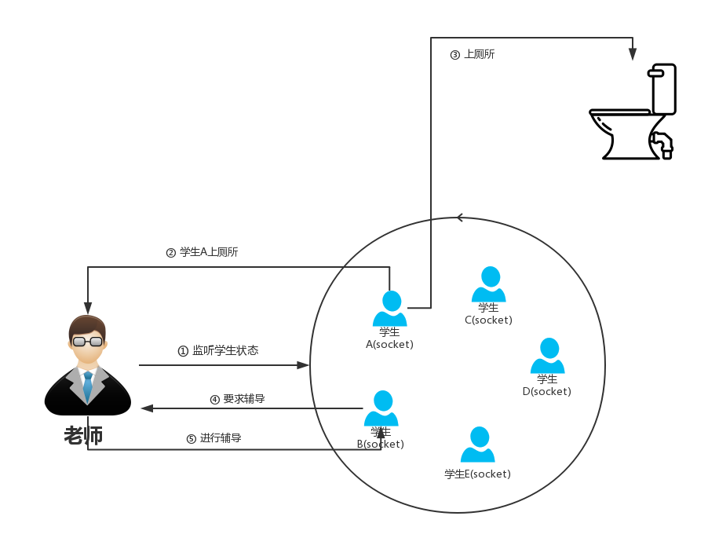

# Python全栈之路系列之IO多路复用



## What is IO Multiplexing?

IO多路复用是指内核一旦发现进程指定的一个或者多个IO条件准备读取，它就通知该进程。

举例说明

你是一名老师(线程)，上课了(启动线程)，这节课是自习课，学生都在自习，你也在教室里面坐着，只看着这帮学生，什么也不干(休眠状态)，课程进行到一半时，A同学(socket)突然拉肚子，举手说：老湿我要上厕所(read)，然后你就让他去了，过了一会，B同学(socket)在自习的过程中有个问题不太懂，就请你过去帮她解答下(write)，然后你就过去帮他解答了。

上述这种情况就是IO多路复用，你就是一个IO，那么你解决了A同学的问题和B同学的问题，这就是复用，多路网络连接复用一个io线程。

与多进程和多线程技术相比，I/O多路复用技术的最大优势是系统开销小，系统不必创建进程/线程，也不必维护这些进程/线程，从而大大减小了系统的开销。

目前常见支持I/O多路复用的系统调用有 select，poll，epoll，I/O多路复用就是通过一种机制，一个进程可以监视多个描述符，一旦某个描述符就绪（一般是读就绪或者写就绪），能够通知程序进行相应的读写操作

## What is a select?

select 监视的文件描述符分3类，分别是writefds、readfds和exceptfds，程序启动后select函数会阻塞，直到有描述符就绪（有数据 可读、可写、或者有except），或者超时（timeout指定等待时间，如果立即返回设为null即可），函数返回，当select函数返回后，可以通过遍历fdset，来找到就绪的描述符。

- 图


- 特点

1. select最大的缺陷就是单个进程所打开的FD是有一定限制的，它由FD_SETSIZE设置，默认值是1024；
2. 对socket进行扫描时是线性扫描，即采用轮询的方法，效率较低；
3. 需要维护一个用来存放大量fd的数据结构，这样会使得用户空间和内核空间在传递该结构时复制开销大；

Python实现select模型代码

```Python
#!/usr/bin/env python
# _*_coding:utf-8 _*_

import select
import socket

sk1 = socket.socket()
sk1.bind(('127.0.0.1', 8002, ))
sk1.listen()

demo_li = [sk1]
outputs = []
message_dict = {}

while True:
    r_list, w_list, e_list = select.select(sk1, outputs, [], 1)

    print(len(demo_li),r_list)

    for sk1_or_conn in r_list:

        if sk1_or_conn == sk1:
            conn, address = sk1_or_conn.accept()
            demo_li.append(conn)
            message_dict[conn] = []
        else:
            try:
                data_bytes = sk1_or_conn.recv(1024)
                # data_str = str(data_bytes, encoding="utf-8")
                # print(data_str)
                # sk1_or_conn.sendall(bytes(data_str+"good", encoding="utf-8"))
            except Exception as e:
                demo_li.remove(sk1_or_conn)
            else:
                data_str = str(data_bytes, encoding="utf-8")
                message_dict[sk1_or_conn].append(data_str)
                outputs.append(sk1_or_conn)

    for conn in w_list:
        recv_str = message_dict[conn][0]
        del message_dict[conn][0]
        conn.sendall(bytes(recv_str+"Good", encoding="utf-8"))
        outputs.remove(conn)
```

## What is a poll?

**基本原理：**

poll本质上和select没有区别，它将用户传入的数组拷贝到内核空间，然后查询每个fd对应的设备状态，如果设备就绪则在设备等待队列中加入一项并继续遍历，如果遍历完所有fd后没有发现就绪设备，则挂起当前进程，直到设备就绪或者主动超时，被唤醒后它又要再次遍历fd。这个过程经历了多次无谓的遍历。

它没有最大连接数的限制，原因是它是基于链表来存储的，但是同样有一个缺点：

1. 大量的fd的数组被整体复制于用户态和内核地址空间之间，而不管这样的复制是不是有意义。
2. poll还有一个特点是“水平触发”，如果报告了fd后，没有被处理，那么下次poll时会再次报告该fd。

## What is a epoll?

poll是在2.6内核中提出的，是之前的select和poll的增强版本。相对于select和poll来说，epoll更加灵活，没有描述符限制。epoll使用一个文件描述符管理多个描述符，将用户关系的文件描述符的事件存放到内核的一个事件表中，这样在用户空间和内核空间的copy只需一次。

**基本原理：**

epoll支持水平触发和边缘触发，最大的特点在于边缘触发，它只告诉进程哪些fd刚刚变为就绪态，并且只会通知一次。还有一个特点是，epoll使用“事件”的就绪通知方式，通过epoll_ctl注册fd，一旦该fd就绪，内核就会采用类似callback的回调机制来激活该fd，epoll_wait便可以收到通知。

**epoll的优点：**

1. 没有最大并发连接的限制，能打开的FD的上限远大于1024（1G的内存上能监听约10万个端口）。
2. 效率提升，不是轮询的方式，不会随着FD数目的增加效率下降。只有活跃可用的FD才会调用callback函数；即Epoll最大的优点就在于它只管你“活跃”的连接，而跟连接总数无关，因此在实际的网络环境中，Epoll的效率就会远远高于select和poll。
3. 内存拷贝，利用mmap()文件映射内存加速与内核空间的消息传递；即epoll使用mmap减少复制开销。

epoll对文件描述符的操作有两种模式：LT（level trigger）和ET（edge trigger）。LT模式是默认模式，LT模式与ET模式的区别如下：

**LT模式：**当epoll_wait检测到描述符事件发生并将此事件通知应用程序，应用程序可以不立即处理该事件。下次调用epoll_wait时，会再次响应应用程序并通知此事件。

**ET模式：**当epoll_wait检测到描述符事件发生并将此事件通知应用程序，应用程序必须立即处理该事件。如果不处理，下次调用epoll_wait时，不会再次响应应用程序并通知此事件。

**LT模式**
LT(level triggered)是缺省的工作方式，并且同时支持block和no-block socket。在这种做法中，内核告诉你一个文件描述符是否就绪了，然后你可以对这个就绪的fd进行IO操作。如果你不作任何操作，内核还是会继续通知你的。

**ET模式**
ET(edge-triggered)是高速工作方式，只支持no-block socket。在这种模式下，当描述符从未就绪变为就绪时，内核通过epoll告诉你。然后它会假设你知道文件描述符已经就绪，并且不会再为那个文件描述符发送更多的就绪通知，直到你做了某些操作导致那个文件描述符不再为就绪状态了(比如，你在发送，接收或者接收请求，或者发送接收的数据少于一定量时导致了一个EWOULDBLOCK 错误）。但是请注意，如果一直不对这个fd作IO操作(从而导致它再次变成未就绪)，内核不会发送更多的通知(only once)。ET模式在很大程度上减少了epoll事件被重复触发的次数，因此效率要比LT模式高。epoll工作在ET模式的时候，必须使用非阻塞套接口，以避免由于一个文件句柄的阻塞读/阻塞写操作把处理多个文件描述符的任务饿死。

在select/poll中，进程只有在调用一定的方法后，内核才对所有监视的文件描述符进行扫描，而epoll事先通过epoll_ctl()来注册一个文件描述符，一旦基于某个文件描述符就绪时，内核会采用类似callback的回调机制，迅速激活这个文件描述符，当进程调用epoll_wait()时便得到通知。(此处去掉了遍历文件描述符，而是通过监听回调的的机制。这正是epoll的魅力所在。)